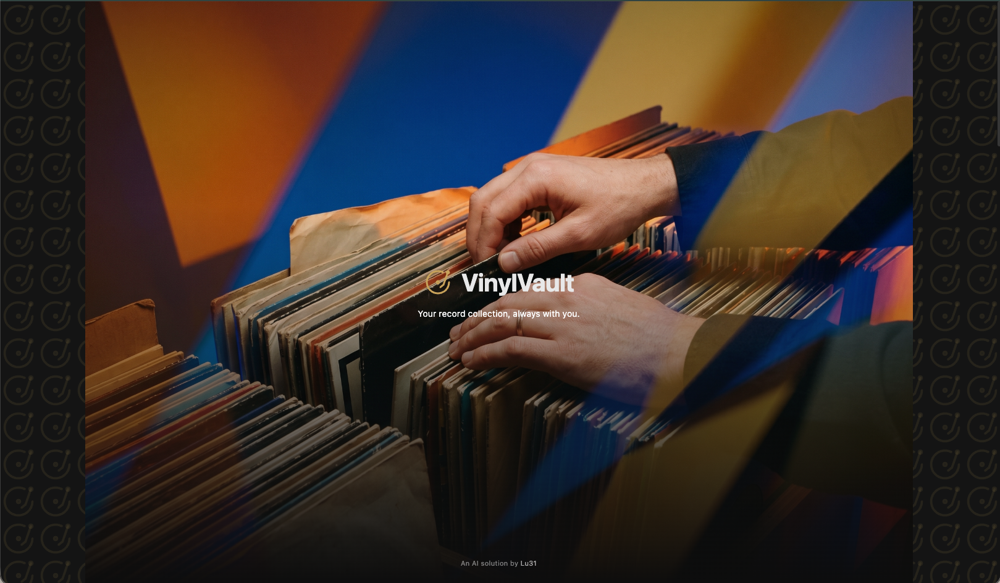
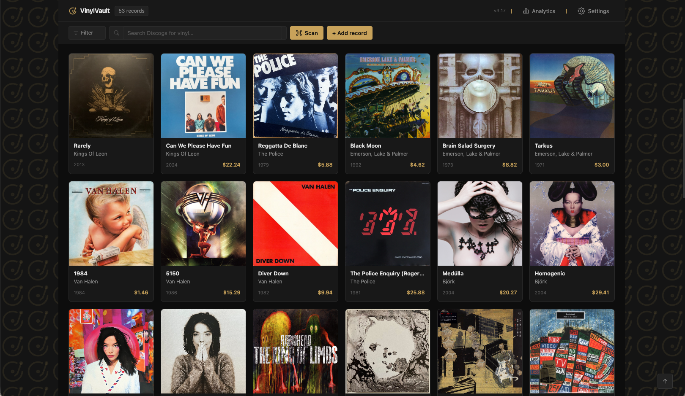
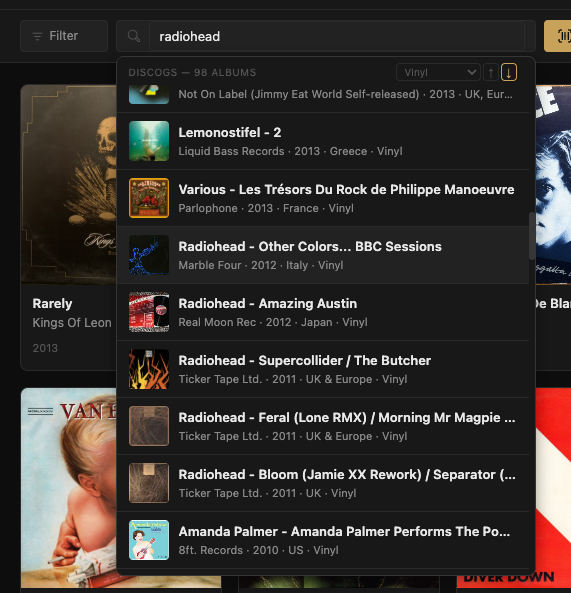
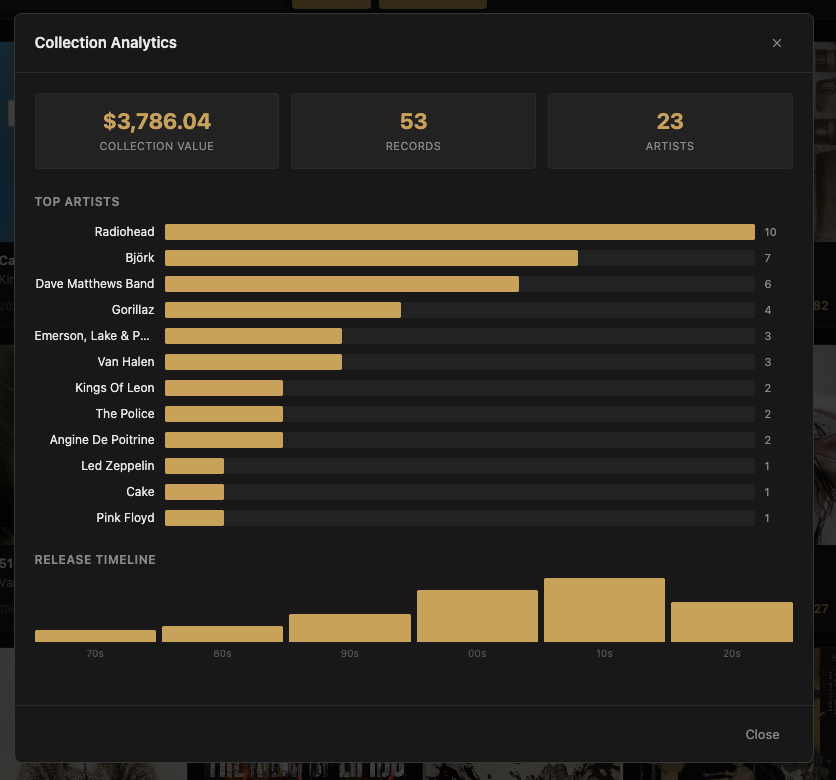
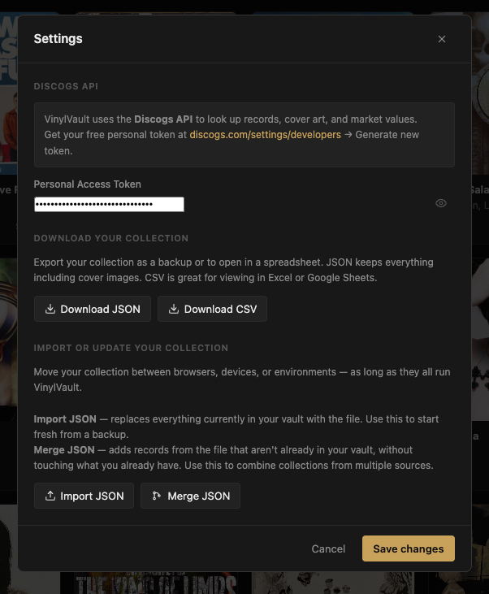
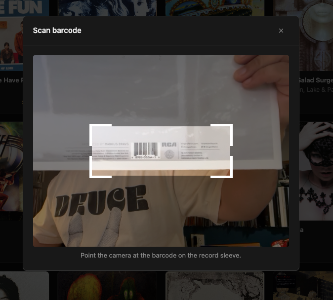
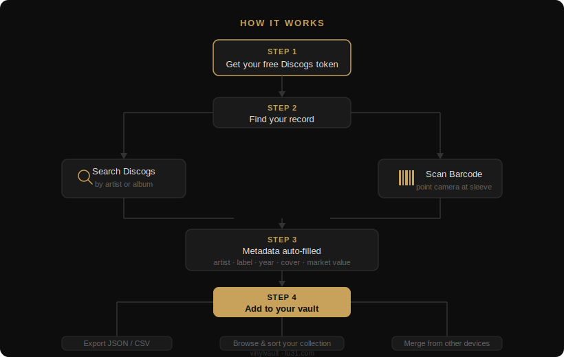

# VinylVault

  

## The Story

I have been collecting vinyl records for many years. Like most collectors, my system for tracking everything was somewhere between a memory and a messy CSV file. I knew what I had, mostly, but not always what I paid, whether something was a special edition, or if it was signed. My original Pink Floyd *The Wall*, signed by Roger Waters himself, deserved better than a spreadsheet row.

So I built VinylVault, not by sitting down with a code editor, but through a long and iterative conversation with Claude Code, Anthropic's AI system, across seventeen versions.

What I brought to it was twenty-plus years of product design experience. I knew what the app needed to feel like, how the flow had to work, where friction would kill the experience, and when something just looked done versus when it was actually right. Those instincts don't come from a tutorial. They come from years of shipping real products, working with real users, and learning to tell the difference between a good decision and a comfortable one.

The AI handled the implementation. I handled the product thinking. That combination, a designer who knows what to build and why, working with an AI that knows how to build it, is the real story behind VinylVault. The barrier to shipping something real is no longer writing code. It's knowing what to build.

**Live app:** [lu31.github.io/vinylvault](https://lu31.github.io/vinylvault/)

---

## Updates

### v4.0 — May 2026

The record detail view got a meaningful upgrade. What was a single panel showing cover art, value, and metadata is now a tabbed interface with two views.

The first tab, Info, is exactly what it was before — nothing changed there.

The second tab, Tracklist, is new. Opening it fetches the full track list from Discogs, then checks the iTunes catalogue in parallel to see which tracks have audio previews available. The ones that do get a small icon next to them. Tapping a track expands the row: the album cover appears as a spinning vinyl record, the preview plays automatically, and a close button collapses it again when you're done. The whole thing works without a login, an account, or an extra API key.

The detail modal also got a layout fix along the way. The header and footer are now always visible regardless of how long the content is, with only the content area scrolling. A small change, but it was overdue.

### v4.1 — May 2026

VinylVault is now licensed under [CC BY-NC 4.0](https://creativecommons.org/licenses/by-nc/4.0/). Free to use, share, and build on for personal purposes. Not for commercial use. The license notice is visible in the app footer so there is no ambiguity about how it can be used.

---

## What it does

VinylVault is a single-page app that connects to the Discogs database and gives you a clean, fast way to manage your vinyl collection — from your browser, with no install required.

- **Barcode scanning** — point your phone camera at a sleeve, it pulls the metadata automatically
- **Discogs search** — search by artist or album, filter by format (Vinyl, CD, Cassette), sort by year
- **Market value tracking** — pulls current Discogs marketplace data for each record
- **Cover art** — auto-fetched from Discogs, or upload your own
- **Local storage** — your collection lives in your browser, no account needed
- **Export & Import** — download your collection as JSON or CSV; import it back on any device
- **Merge collections** — combine collections from multiple browsers or devices without losing existing records
- **Recent search history** — remembers your last searches
- **Dark UI** — designed to look like something worth opening every day

---

## Screenshots

| Collection | Search |
|:---:|:---:|
|  |  |

| Analytics | Settings |
|:---:|:---:|
|  |  |

  
   <em>Barcode scanner — point your camera at the sleeve</em>

---

## How it works

  

## Getting started

1. Open the [live app](https://lu31.github.io/vinylvault/) or download `index.html` and open it in any browser
2. Go to **Settings** and enter your free Discogs API token
   - Get one at [discogs.com/settings/developers](https://www.discogs.com/settings/developers) → Generate new token
3. Search for a record or scan a barcode to add your first album

That's it.

---

## Built with

- Vanilla HTML, CSS, JavaScript — no frameworks, no build step
- [Discogs API](https://www.discogs.com/developers/)
- Built conversationally with [Claude Code](https://claude.ai/code) by Anthropic
- Deployed via GitHub Pages

---

## About

If you collect vinyl, give it a try. It is completely free. If you build things with AI and want to compare notes, I'd like that too.

**Long live the vinyl.**

---

*Built by [lu31.com](https://lu31.com), product designer and vibe coder.*

---

*Licensed under [CC BY-NC 4.0](https://creativecommons.org/licenses/by-nc/4.0/) — free for personal use, not for commercial use.*
